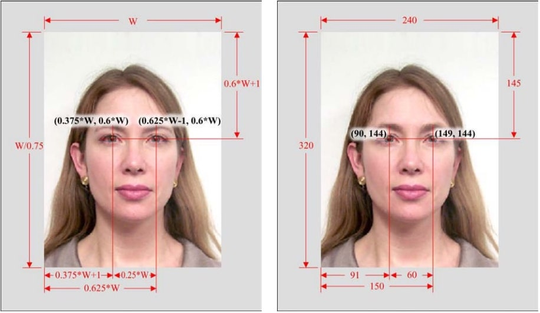

## Utils for face extraction from image
#### Can use both with mediapipe or dlib* on python

-----
\* for calculating only with dlib, use `crop_faces_ISO_IEC_19794.py`

P.S. But if you want all features like head pose filtering and etc, then use `cropper.py`
